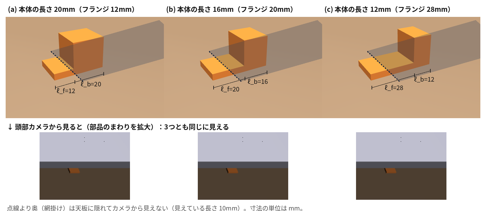
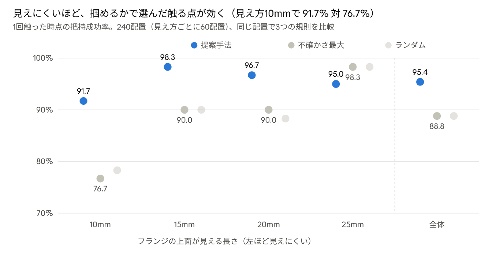
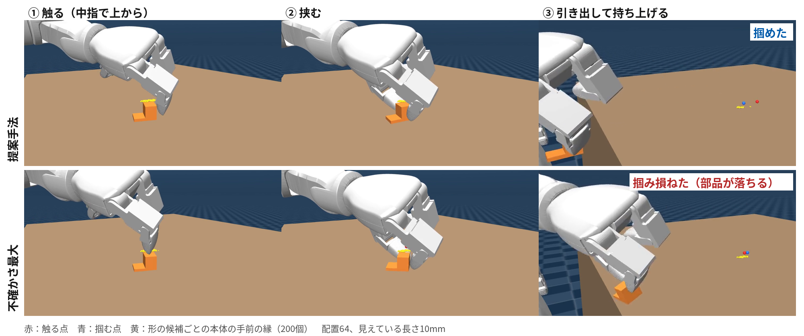
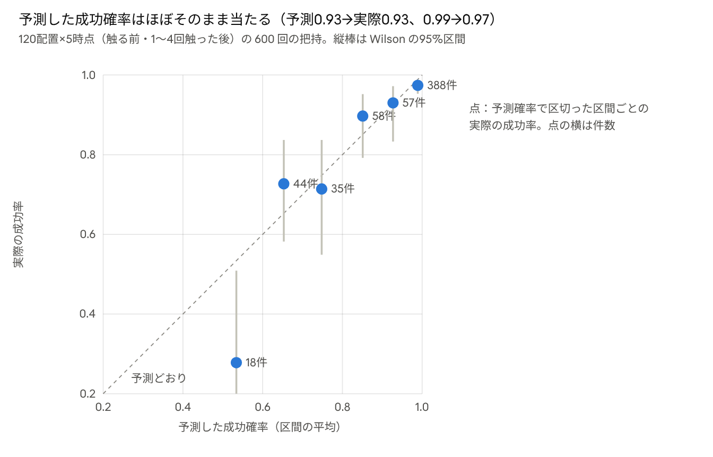

# 棚の奥で一部が隠れた部品を掴むための触る点の選択：物理から学習した成功確率を形の候補で平均する

Oct 1, 2026 · @Nishina

コード・学習済みの予測器・実験結果・再現手順：<https://github.com/Nishina-N/Physics-Informed-Touch-Selection>

## 概要

棚の奥に置かれた小部品は、上の段の天板で奥が隠れ、頭部カメラには手前の一部しか見えない。見えない部分の形が分からないまま掴むと失敗しやすく、棚の下では失敗した部品が大きく動くため掴み直しも難しい。本研究は、見えた部分と軽く触った結果から部品の形の候補を粒子で推定し、物理シミュレーションで学習した把持成功確率を候補で平均して、掴む点と触る点を選ぶ手法を提案する。触る点は「触った後に得られる最良の成功確率の期待値」が最大の点とし、触覚で形を補う先行研究が用いる「形の不確かさが最大の点」と比較する。MuJoCo 上の人型ロボット（Unitree G1、3指ハンド Dex3）で、手前に低いフランジ、奥に掴める本体をもつ部品を240配置で評価した。1回触った時点の把持成功率は、提案手法 95.4%、不確かさ最大 88.8%、ランダム 88.8% であり、同じ配置どうしの差は +6.7 ポイント（95% 信頼区間 \[+2.1, +11.3\]、McNemar 検定 p=0.005）であった。差は見えにくい条件ほど大きかった。一方、成功確率が閾値を超えたら触るのをやめる規則は、毎回1回だけ触る場合と差がなかった。触った後に腕を天板の外へ戻さず、そのまま掴みに移ることで、掴み終わるまでの時間は1回触る場合で約14%短くなった。実機での検証は今後の課題である。

## 1 はじめに

工場や倉庫で人型ロボットに部品を取らせるとき、部品はしばしば棚の段の奥に置かれている。頭部のカメラからは上の段の天板が視界を遮り、部品の手前の一部しか見えない。見えない奥の形が、どこを挟めば持ち上がるかを決めている場合、見えた部分だけで掴むと失敗する。さらに棚の下では、掴み損ねた手を引き出すときに部品を引きずったり弾いたりしやすい。本研究のシミュレーションでは、失敗した把持の91%で部品が10mm以上動いた（6章）。失敗から学んで掴み直すより、掴む前に軽く触って形を確かめる方が安全である。

一部が見えた物体の形を触覚で補って掴む研究は多い。Act-VH \[1\] と VISHAC \[2\] はカメラ1視点の点群から形を補完し、形の不確かさが最大の所を決めた回数だけ触ってから掴む。de Farias ら \[4\] は掴む動作そのもので形を探り、ShapeGrasp \[3\] は触らずに掴んで失敗時の接触から形を直す。Lundell ら \[5\] は補完した形の候補すべてで平均した把持の質で掴み方を選ぶが、触らない。触って形を補う研究の多くは、触る点を「形の不確かさが最大の所」で選ぶ \[1\]\[6\]\[11\]。この基準は形を正確に復元するには合理的だが、掴むためには必ずしも最善ではない。不確かさが大きいのは、掴みの成否に関係の薄い所（たとえば部品の奥の端）であることがあるからである。

本研究は、触る点を「触った後に得られる最良の把持成功確率の期待値」が最大の点として選ぶ。成功確率は、形の候補（粒子）ごとに物理シミュレーションの試行から学習した小さなニューラルネットで出し、候補で平均する。平均の形は Lundell ら \[5\] と同じだが、本研究はそれを掴み方の選択だけでなく触る点の選択にも使う。この考え方は、視覚を失った後の位置のずれを掴み方の空間で考えて探った DA-GRD \[7\] を、隠れた形に広げたものとも言える。

本研究の貢献は次の3点である。

1. 部分的な視覚と軽い接触から隠れた形の候補を推定し、候補ごとに学習した把持成功確率の期待値で触る点を選ぶ手法。
2. 棚の天板による隠れと手の入り方の制約を含む人型ロボットのシミュレーションで、同じ240配置を用いた対応のある比較。提案手法は1回触った時点で、形の不確かさ最大の点を触る場合より成功率が6.7ポイント高い。
3. 触る回数を成功確率の閾値で決める規則が、この設定では固定1回と差がないという否定的な結果と、その理由の分析。

## 2 関連研究

### 2.1 触覚で形を補って掴む

Act-VH \[1\] は暗黙関数のニューラルネットでカメラ1視点の形を補完し、形の候補のばらつきが最大の所を触る。実機で2指グリッパーを用い、5回触ると把持成功率が38%から80%に上がった。VISHAC \[2\] はその高速版である。いずれも触る回数は固定で、物体は机に固定されている。de Farias ら \[4\] はガウス過程暗黙曲面（GPIS）で形を表し、掴む動作の接触で形を更新しながら力の釣り合いの確率を最大化する（シミュレーションのみ、60回固定）。解析的な確率では持ち上げに成功しても揺すると落ちる食い違いが報告されている。ShapeGrasp \[3\] は触らずに掴み、指の接触と指が通った空間から形を直して掴み直す。候補の掴み方は物理シミュレーションで評価するが、評価は補完した1つの形に対して行い、摩擦や質量は使っていない。カメラを使わず触覚だけで位置や形を推定する研究 \[9\]\[10\]\[11\] は、物体の識別や形の復元を目的とする。本研究は、部分的な視覚で候補を絞り、触る点を掴むための基準で選ぶ点でこれらと異なる。

### 2.2 不確かさの下での把持計画

Lundell ら \[5\] は、ドロップアウトで得た形の候補すべてで把持の質を平均し、最も頑健な掴み方を選ぶ。Dex-Net 2.0 \[12\] はシミュレーションで作った大量のデータから把持成功確率を学習する。Hsiao ら \[13\] は位置の不確かさを信念として持ち、触覚で更新しながら掴む。本研究の成功確率は、形の候補ごとに物理の試行結果から学習し、摩擦・質量・指の制御のばらつきを学習データの中で平均したものである。

### 2.3 能動的な触覚探索

Dragiev ら \[6\] は GPIS の分散を使って「探る掴み」と「確実な掴み」を作り分けたが、両者の切り替え方は範囲外としている。Kissoum \[11\] は形の分散に基づく情報量で次の探索を選び、形の復元精度で評価する。DA-GRD \[7\] は、視覚を失った後の位置のずれを掴み方の空間で考え、掴み方が定まるまでだけ探る。LGWS \[8\] は視覚なしで作業面を触って走査し、粒子フィルタで位置を推定する。本研究は DA-GRD と同じく探索の目的を掴むことに置くが、対象は位置ではなく隠れた形であり、固定の許容幅の代わりに学習した成功確率を使う。

### 2.4 隠れと触覚

Jiang ら \[14\] は、散らかりや隠れが増えるほど触覚と力が把持に効くことを実機で示した。Caddeo ら \[15\] は手による隠れを段階分けして形と姿勢の推定を評価した。DexTacWAM \[16\] は視覚と触覚を予測する世界行動モデルで隠れた物体を掴むが、成功デモだけでは探る動作や立て直しを学べないことを限界に挙げている。これらはいずれも机の上で物体自身や手、周りの物が隠す設定であり、棚の天板のように隠れる領域と手の入り方の制約が重なる設定は扱っていない。

## 3 問題設定

**部品の形の族。** 部品は、手前の低いフランジ（高さ 4mm）と、その奥の掴める本体（幅・高さ W = 20mm）をつないだ1つの剛体である。形の型は既知とし、フランジの長さと本体の長さを未知とする。部品の状態を次のように表す。

　　θ = (x\_f, y, ψ, ℓ\_f, ℓ\_b)

x\_f と y は手前の面の中心の位置、ψ は向き、ℓ\_f はフランジの長さ（10〜30mm）、ℓ\_b は本体の長さ（12〜20mm）である（図1）。部品の軸に沿った座標 a では、本体は a ∈ \[ℓ\_f, ℓ\_f + ℓ\_b\] を占める。フランジだけを挟んでも部品は持ち上がらない。

**見え方。** 部品は机上20cmの天板の下にあり、頭部カメラからは天板の前端より奥が見えない。見え方を「フランジの上面が手前から見える長さ v」で定め、v ∈ {10, 15, 20, 25} mm の4段階とする。v = 10mm では本体は常に見えず、v = 25mm では配置の7割で本体の手前の縁が見える。

図1　形の族の例。上：本体の長さ（ℓ\_b）とフランジの長さ（ℓ\_f）が違う部品3つ（MuJoCo で描画）。点線より奥は天板に隠れてカメラから見えない（見えている長さ v = 10mm）。下：同じ配置を頭部カメラから見た画像。3つともフランジの手前だけが見え、区別できない。どこを挟めばよいかは本体の位置で大きく変わるため、触って確かめる必要がある。

**観測。** 開始時に頭部カメラから部品の領域分割と深度画像を得る。その後、点 u を上から軽く触ると、4通りの観測 o のいずれかを得る。

　　o ∈ { 外れ, 指先の中央で本体, それ以外で本体, フランジ }

**把持と成功。** 把持は、指定した挟む点 g の真上へ天板の下で手を運び、中指と親指で挟み、手前へ引き出して持ち上げる動作である。触らずに掴むときは天板の手前から水平に手を差し込み、触った後は手を天板の外へ戻さず、触った位置からそのまま g へ移る。成功 S = 1 は、2秒保持した後に部品が初期位置より4cm以上高いこととする。成否は部品の状態 θ と挟む点 g に加え、観測できない物理の値 ξ（摩擦、質量、指の制御ゲイン）に依存する。

**目的。** k 回触った後に掴んだときの成功率を高める触る点の選び方を求める。主な評価は k = 1 で行う。

## 4 手法

部品の状態の不確かさを粒子 {θ\_i}（i = 1, …, N、N = 200）で表し、カメラで初期化して触るたびに更新する。掴む点と触る点は、粒子で平均した成功確率から選ぶ。

### 4.1 カメラによる初期推定

領域の形だけでは、向きも本体の位置もほとんど決まらなかった。部品が小さく（画像上で幅約20画素）、領域分割の境界の誤りの方が、向きや本体の位置を変えたときの見え方の差より大きいためである。そこで深度を次の3つに使う。

1. **向き：** フランジの高さの点（机面から1.5〜7mm）を左右方向に2mmごとに区切り、各区間で最も手前の点（5パーセンタイル）に直線を当てはめて手前の縁の向きを得る。誤差は40配置で平均2.3°、最大5.1°であった。
2. **位置：** 粒子ごとに、フランジと本体を画像に投影した凸包の和から手前の遮蔵物（天板など）を除いた「見えるはずの領域」を作り、観測の領域と照合する。境界1画素は照合に使わない（使うと「本体が隠れている」側に偏った）。手前の面の位置の誤差は平均1.6mmであった。
3. **本体：** 高さ10mmを超える深度の点があれば本体が見えていると判定し、その点の部品軸方向の手前側（30パーセンタイル）から ℓ\_f を決める（真の縁の±1mm）。見えなければ、高さ10mmで天板の縁に隠れ始める位置より奥に本体があるとして ℓ\_f を一様に引き直す。ℓ\_b は事前分布のままである。

### 4.2 形の候補ごとの把持成功確率

形の候補 θ を挟む点 g で挟んだときの成功確率を、小さな多層パーセプトロン f\_φ で予測する。入力 z(θ, g) は、本体の手前の縁から挟む点までの距離、挟む点から奥の縁までの距離、横のずれ、向き、本体の長さ、天板の前端から挟む点までの奥行きの6つである。物理の値 ξ は入力に入れず、学習データの中でばらつかせるので、f\_φ は ξ について平均した成功確率を近似する。粒子で表した信念 b の下での成功確率は、候補での平均とする \[5\]。

　　P(S=1 | g, b) = (1/N) Σᵢ f\_φ( z(θᵢ, g) )、　g\*(b) = argmax\_{g∈G} P(S=1 | g, b)

挟む点の候補 G は、推定の平均の部品軸に沿った1mm間隔の点である。

### 4.3 触る観測のモデルと更新

触った点 u の、候補 θ に対する部品軸方向の座標を a、横のずれを c とし、本体の手前の縁からの距離 a − ℓ\_f と奥の縁からの距離 a − ℓ\_f − ℓ\_b で観測を決める。境界は予備実験で測ったもので、手前の縁の −11mm まではフランジ、−11〜−3mm は指の腹が本体に当たる（それ以外で本体）、−3mm から奥の縁の +2mm までは指先の中央で本体、+2〜+12mm は再び指の腹、それより奥は外れである。横に |c| > W/2 + 3mm 外れれば何にも当たらない。各境界は幅1mmのシグモイドでぼかし、どの観測にも確率 ε = 0.02 を残す。触った後は尤度 P(o | u, θ\_i) で重みを付けて引き直し、小さな雑音を加える。

### 4.4 触る点の選択

触る点の候補 u ごとに、各観測 o が得られる確率と、o で更新した信念 b\_{u,o} の下での最良の成功確率を計算し、その期待値が最大の点を選ぶ。

　　u\* = argmax\_{u∈U} Σ\_o P(o | u, b) · max\_{g∈G} P(S=1 | g, b\_{u,o})

触る点の候補 U は部品軸に沿った3mm間隔の点である。形の候補と挟む点の組み合わせの成功確率の行列を1回だけ計算し、観測ごとの重みを掛けるだけで b\_{u,o} の下の成功確率を求める。

比較する基準は次の2つである。不確かさ最大では、点 u の真下に本体があると考える粒子の割合 p(u) の分散 p(u)(1 − p(u)) が最大の点を選ぶ。これは Act-VH \[1\] の「占有の分散が最大の所を触る」基準を本問題に当てはめたものである。ランダムでは U から一様に選ぶ。

### 4.5 触る動作

触る動作は、部品を動かさないように約10gで止める軽い接触である。掴むときと同じ手首の向きのまま親指だけを上へ退避させ、中指の先を本体の上面の1cm上から1mmずつ下ろし、接触力が0.1Nを超えたら止める。机まで下ろして部品に当たらなければ外れとする。接触点が指先の中央から4mm以内かどうかと、接触した形状（本体かフランジか）で観測を分ける。実機では感圧センサーの接触位置と接触時の指先の高さで区別することを想定している。触った後は指先を触り始めの高さへ戻すだけで、腕は天板の外へ戻さない。次に触る点や掴む点へは、天板の下のまま今の高さ以上を保って水平に移り、親指は上げたまま運んで、掴む点の真上で0.8秒かけて掴む形へ戻す。指先を戻す動きは12点に分けて真上へ動かす（粗く分けると関節補間の曲がりで指が部品を約1mm引きずった）。

## 5 実験設定

### 5.1 シミュレーション環境

| 項目 | 設定 |
| --- | --- |
| シミュレータ | MuJoCo \[17\] 3.14、刻み 2ms。接触は楕円の摩擦錐と impratio 10、部品はねじり摩擦あり |
| ロボット | mujoco\_menagerie \[18\] の Unitree G1 と Dex3（3指）。骨盤は固定し、全身に重力補償を掛ける |
| 把持 | 中指と親指の指先で挟む（人差し指は握り込む）。逆運動学は mink \[19\]（右腕7関節）で、棚の下では挟む点を直線で動かす |
| 棚 | 机上面 0.80m、天板は机上 20cm（厚さ 1.5cm）。部品の手前の面はロボットの前方 31cm・右 25cm |
| カメラ | 頭部の D435i 相当（640×480）。領域分割の境界に±1画素の誤り、深度に σ(z) = z²·0.08 / (f·b) のガウス雑音 |

### 5.2 配置と物理のばらつき

配置は乱数の種ごとに固定し、すべての比較条件で同じ配置を使う。見え方 v は4段階を順に割り当てる。ℓ\_f と ℓ\_b は一様分布、向きは ±20°、左右の位置は ±10mm の範囲で引く。物理の値 ξ として、摩擦係数（0.3〜1.0、指と部品の両方）、部品の質量（±30%）、指の位置制御のゲイン（±20%）を配置ごとに引く。質量を変えた後は MuJoCo の内部定数を計算し直す（しないと数値的に不安定になり、成功率が見かけ上下がる）。触らずに最も成功しやすい1点を挟んだ場合の成功率が計算上約57%になるように、ℓ\_f と ℓ\_b の範囲を定めた。

### 5.3 予測器の学習

学習データは8,000回の把持試行である。各試行で配置と ξ を引き、真の形に対して挟む点を部品軸方向に \[ℓ\_f − 6mm, ℓ\_f + ℓ\_b + 4mm\]、横に ±8mm の範囲で引いて掴む。成功率は48%であった。f\_φ は隠れ層 64×64 の多層パーセプトロン（scikit-learn \[20\]）で、後ろの20%での正解率は94%、Brier スコアは0.044であった。

### 5.4 比較条件

**触る点の選び方（主な比較）。** 240配置のそれぞれで、提案手法・不確かさ最大・ランダムの3規則のうち一つで最大2回触り、各時点で g\* を掴んだ結果を記録する。推定、予測器、掴む点の選び方は3規則で共通である。

**触る回数と止め方（補助的な比較）。** 240配置のうち最初の120配置で、提案手法で最大4回触り、k 回目（k = 0, …, 4）の時点で掴んだ結果を記録する。この記録から、触らない（A）、n 回触る（Bn）、成功確率が初めて τ 以上になった時点で掴む（C(τ)、上限4回）の結果を計算する。触る点の選び方は τ によらないので、この計算は各条件を別々に実行した場合と一致する。

**分岐の実行。** 各時点の把持は、シミュレーションの状態を複製した上で行い、元の状態から触る動作を続ける。同じ状態から2回掴んで同じ結果になることと、複製せずに掴んだ場合と一致することを確かめた。

### 5.5 評価指標

主指標は1回触った時点の把持成功率である。条件間の差は同じ配置どうしで求め、配置を単位としたブートストラップ（3,000回）で95%信頼区間を、片方だけが成功した配置数に McNemar の正確検定を適用する。補助的に、見え方別の成功率、触った後の本体の手前の縁の推定のばらつき、予測確率と実際の成功率の一致（較正）、失敗した把持での部品の移動距離を報告する。

## 6 結果

### 6.1 触る点の選び方

図2　run\_touchsel.py の結果（240配置、触った後は天板の下のまま掴みに移る動き）

1回触った時点の成功率は、提案手法 95.4%、不確かさ最大 88.8%、ランダム 88.8% であった（図2）。同じ配置どうしの差は、不確かさ最大に対して +6.7 ポイント（95% 信頼区間 \[+2.1, +11.3\]、片方だけ成功した配置は提案手法 23・不確かさ最大 7、McNemar 検定 p = 0.005）、ランダムに対しても +6.7 ポイント（\[+2.5, +11.3\]、23・7、p = 0.005）であった。差は見えにくい条件ほど大きく、不確かさ最大に対して見え方 10mm で +15.0 ポイント \[+3.3, +26.7\]、15mm で +8.3 \[0.0, +16.7\]、20mm で +6.7 \[0.0, +15.0\]、25mm で −3.3 \[−8.3, 0.0\] であった。25mm では本体の手前の縁がカメラに見えることが多く、どの規則でも差が出にくい。

1回触った後の本体の手前の縁の推定のばらつき（標準偏差の中央値）は、提案手法 2.7mm、不確かさ最大 3.0mm、ランダム 3.1mm であった。2回触ると成功率は 95.0%、91.7%、88.3% となり、不確かさ最大との差は +3.3 ポイント \[0.0, +7.1\]（14・6、p = 0.12）に縮んだ。不確かさ最大の規則でも2回目で必要な所に届くためである。

図3　配置64（見えている長さ 10mm、本体は手前の面から 15〜31mm）。上段：提案手法は本体の奥の端より先（手前の面から 43mm）を触って外れ、「本体はそこまで奥にない」と分かって本体の手前の縁の推定のばらつきが 5.9mm から 2.9mm に縮み、掴めた。下段：不確かさ最大は本体の真ん中（23mm）を触って当たったが、手前の縁のばらつきは 4.3mm 残り（予測した成功確率 0.63）、掴み損ねた（view\_trial.py で撮影）。

図3は、2つの規則の違いを1配置で示す。不確かさ最大の規則は、本体が「ありそうでなさそうな」所を触るので本体の存在は確かめられるが、挟む点を決める手前の縁の位置はあまり絞れない。提案手法は、触った結果が挟む点の選択を最も変える所を触る。この配置ではそれが本体の奥の端より先で、「外れ」という結果から「本体はそこまで奥にない」、つまり手前の縁もそれだけ手前にあることが分かった。ただし奥を触るのは一つの例で、多くの配置では手前の縁の手前側を触っている（7章）。

### 6.2 触る効果と止め方

| 条件 | 成功率 | 触った回数（平均） | 見え方 10 / 15 / 20 / 25mm の成功率 |
| --- | --- | --- | --- |
| A 触らない | 72.5% | 0 | 53 / 63 / 77 / 97% |
| B1 1回触る | 96.7% | 1 | 90 / 100 / 97 / 100% |
| B2 2回触る | 94.2% | 2 | 87 / 97 / 97 / 97% |
| B3 3回触る | 96.7% | 3 | 97 / 97 / 100 / 93% |
| C(0.85) 確率0.85で止める | 95.0% | 0.96 | 90 / 100 / 97 / 93% |
| C(0.95) 確率0.95で止める | 94.2% | 1.61 | 93 / 100 / 97 / 87% |

表は120配置の結果である。触らずに掴むと成功率は72.5%で、見えにくいほど低い（見え方10mmで53%）。1回触ると96.7%に上がり、それ以上触っても上がらなかった。成功確率が閾値を超えたら触るのをやめる規則 C は、見え方25mmでは触らずに掴むことが多いが、その分わずかに失敗も増え、全体では B1 と差がなかった（C(0.85) と B1 の差 −1.7 ポイント \[−4.2, 0.0\]、触った回数の差 −0.04 回）。

### 6.3 予測の較正

図4　run\_branch.py の結果（120配置×5時点＝600回、触った後は天板の下のまま掴みに移る動き）

粒子で平均した成功確率は、実際の成功率とよく一致した（図4、Brier スコア 0.066）。予測0.9以上の把持が全体の74%を占め、その実際の成功率は93〜97%であった。予測0.6未満の区間（18件）だけは実際が28%と予測より低く、確率が低い側ではやや楽観的である。学習データと同じ分布の確認用データ（1,600件）での Brier スコアは 0.044 であり、推定の誤差を含む本実験でも較正は大きく崩れなかった。学習データは触らずに天板の手前から差し込んで掴む動きで集めたが、触った後に天板の下から掴みに移る動きでも較正は保たれた。

### 6.4 失敗の損

失敗した把持では、部品が大きく動いた。6.2節の120配置では失敗した把持55回の91%で部品が10mm以上動き（中央値 約250mm）、6.1節の240配置では失敗125回の98%で10mm以上動いた（中央値 約140mm）。手を引き出すときに部品を引きずるか弾くためである。一方、触る動作の押し下げ中の部品の移動は最大0.33mmであった。

### 6.5 動作の時間

触った後に腕を天板の外へ戻して差し込み直す動き（初版の実装）と比べ、天板の下のまま掴みに移る今の動きは、開始から掴み終わる（2秒保持の終わり）までのシミュレーション時間の中央値を、1回触る場合で 17.7 秒から 15.2 秒に（約14%）、2回触る場合で 24.3 秒から 17.7 秒に（約27%）縮めた（240配置のうち12配置おきの20配置、提案手法）。腕を天板の外まで往復させる移動がなくなるためで、触る回数が多いほど差が大きい。

## 7 考察と限界

**なぜ1回で足りるのか。** 本問題で把持の成否を決めるのは、主に本体の手前の縁の位置である。挟む点が手前の縁から3.5mm以上、奥の縁から2.5mm以上内側にあればよい。提案手法は、触った結果で候補が大きく分かれる所、つまり本体の縁のあたりを触る。1回目に触った点は、240配置のうち59%が本体の外（手前の縁より3mm以上手前、または奥の縁より5mm以上奥）、本体の中ほどは5%だけであり、観測は「指の腹で本体」46%、「指先の中央で本体」38%、「フランジ」10%、「外れ」6%と分かれた。指の腹やフランジに当たったという結果が、縁がどちら側にあるかを教える。一方、不確かさ最大は本体の外を触ったのが18%にとどまり、73%で指先の中央が本体に当たった。「そこに本体がある」ことは確かめられるが、挟む点を決める手前の縁の位置はあまり絞れない。この差は形の復元精度の差（触った後の手前の縁のばらつき 2.7mm 対 3.0mm）より、把持成功率の差としてはっきり現れた。触覚で形を補うとき、探索の目的を形の復元ではなく下流の把持に置くことの意味を示している。

**止める判断が効かなかった理由。** うまく選んだ1回の触りで成功率はほぼ上限（約97%）に届き、残る失敗の多くは観測できない物理の値（摩擦など）による。そのため、触る回数を調整しても改善の余地が小さい。見え方がよい設定で触らずに掴むと、わずかに失敗が増えた。触って分かるのが当たり／外れだけの場合や、未知の量が多い場合には、止める判断が効く可能性があるが、本研究では確かめていない。

**触る動作で部品が動くこと。** 推定は部品が動かないと仮定している。最初の実装では、触った後に手を引く途中で指が部品を引きずり（1回あたり約1mm）、触るほど推定がずれて把持の失敗が増えた。指先を細かく分けて真上へ戻し、天板の下では指を下げないように直した後は、触る押し下げ中の部品の移動は最大0.33mmに収まった。部品の動きを推定に含めることは今後の課題である。

**動作を変えても結論は変わらない。** 初版の実装では、触るたびに腕を天板の外へ戻して差し込み直し、親指をすぐに掴む形へ戻していた。その動きで同じ実験を行った結果は、1回触った時点で提案手法 95.8%、不確かさ最大 90.0%、ランダム 88.3%（不確かさ最大との差 +5.8 ポイント \[+1.7, +9.6\]、p = 0.007）、触らない場合 72.5%、毎回1回触る場合 95.8% であり、結論は同じであった。両方の結果をリポジトリに残している。

**限界。** 第一に、すべてシミュレーションの結果であり、実機では検証していない。触る観測の境界と把持の許容幅はシミュレーションの指の形と接触モデルに依存し、実機の感圧センサーの感度や指の摩擦は学習で振った範囲を超える可能性がある。第二に、形の型を既知とし、未知なのは2つの長さだけである。型の違う部品には、CADから作る形の族や、ニューラルネットによる形の補完 \[1\]\[3\] の候補に置き換える必要がある。触る点の選び方自体は候補の表し方に依存しない。第三に、比較した「不確かさ最大」は Act-VH \[1\] の基準を本問題に当てはめて再実装したもので、元の手法そのものとの比較ではない。第四に、触る点は部品軸に沿った1次元の候補に限っている。

## 8 まとめ

棚の天板で奥が隠れた部品を掴むために、形の候補で平均した把持成功確率を使って触る点を選ぶ手法を提案した。成功確率は、摩擦・質量・指の制御をばらつかせた物理シミュレーションの試行から学習した小さなニューラルネットで出した。240配置の評価で、触った後の最良の成功確率の期待値で触る点を選ぶと、1回触った時点の把持成功率は95.4%となり、形の不確かさが最大の点を触る場合（88.8%）やランダム（88.8%）を上回った。差は見えにくい条件ほど大きく、見えている長さが10mmのとき +15.0 ポイントだった。触らずに掴むと成功率は72.5%にとどまり、失敗した把持の大半で部品が10mm以上動いた。成功確率が閾値を超えたら触るのをやめる規則は、毎回1回触る場合と差がなかった。触った後に腕を天板の外へ戻さずに掴みに移ることで、掴み終わるまでの時間も短くなった。触覚で形を補うときは、形を正確に復元することではなく、掴むことに効く所を触るべきである。実機での検証、形の型の拡張、触る動作による部品の動きの推定への取り込みが今後の課題である。

## 参考文献

[1\] L. Rustler, J. Lundell, J. K. Behrens, V. Kyrki, M. Hoffmann, "Active Visuo-Haptic Object Shape Completion," IEEE Robotics and Automation Letters, 2022. arXiv:2203.09149.

[2\] L. Rustler, J. Matas, M. Hoffmann, "Efficient Visuo-Haptic Object Shape Completion for Robot Manipulation," IROS, 2023. arXiv:2303.04700.

[3\] L. Rustler, M. Hoffmann, "ShapeGrasp: Simultaneous Visuo-Haptic Shape Completion and Grasping for Improved Robot Manipulation," 2026. arXiv:2605.02347.

[4\] C. de Farias, N. Marturi, R. Stolkin, Y. Bekiroglu, "Simultaneous Tactile Exploration and Grasp Refinement for Unknown Objects," IEEE Robotics and Automation Letters, 2021. arXiv:2103.00655.

[5\] J. Lundell, F. Verdoja, V. Kyrki, "Robust Grasp Planning Over Uncertain Shape Completions," IROS, 2019. arXiv:1903.00645.

[6\] S. Dragiev, M. Toussaint, M. Gienger, "Uncertainty Aware Grasping and Tactile Exploration," ICRA, 2013.

[7\] Wang et al., "DA-GRD: Decision-Aware Grasp-Relevant Disambiguation for Tactile Recovery under Perception-to-Execution Mismatches," 2026.

[8\] A. Murali, Y. Li, D. Gandhi, L. Pinto, "Learning to Grasp Without Seeing," ISER, 2018. arXiv:1805.04201.

[9\] "TACTFUL: Tactile-Driven Exploration for Object Localization and Identification in Confined Environments," 2026. arXiv:2606.24712.

[10\] S. Pai et al., "TactoFind: A Tactile Only System for Object Retrieval," ICRA, 2023. arXiv:2303.13482.

[11\] Z. Kissoum, "Tactile SLAM: Simultaneous Reconstruction and Localization of Objects for Robotic Manipulation," Ph.D. thesis, Sorbonne Université, 2023. HAL tel-04536002.

[12\] J. Mahler et al., "Dex-Net 2.0: Deep Learning to Plan Robust Grasps with Synthetic Point Clouds and Analytic Grasp Metrics," RSS, 2017. arXiv:1703.09312.

[13\] K. Hsiao, L. P. Kaelbling, T. Lozano-Pérez, "Robust Grasping Under Object Pose Uncertainty," Autonomous Robots, 31(2–3), 2011.

[14\] Jiang, Dominguez, Seita, "When Does Touch Matter? Charting the Vision-Interaction Gap in Cluttered Dexterous Grasping," 2026.

[15\] Caddeo et al., "Physically Grounded 3D Generative Reconstruction under Hand Occlusion using Proprioception and Multi-Contact Touch," 2026.

[16\] Yuan et al., "DexTacWAM: A Visuo-Tactile World-Action Model for Dexterous Manipulation," 2026.

[17\] E. Todorov, T. Erez, Y. Tassa, "MuJoCo: A Physics Engine for Model-Based Control," IROS, 2012.

[18\] K. Zakka, Y. Tassa, MuJoCo Menagerie contributors, "MuJoCo Menagerie: A Collection of High-Quality Simulation Models for MuJoCo," 2022. https://github.com/google-deepmind/mujoco\_menagerie

[19\] K. Zakka, "mink: Python Inverse Kinematics Based on MuJoCo," 2024. https://github.com/kevinzakka/mink

[20\] F. Pedregosa et al., "Scikit-learn: Machine Learning in Python," Journal of Machine Learning Research, 12, pp. 2825–2830, 2011.
